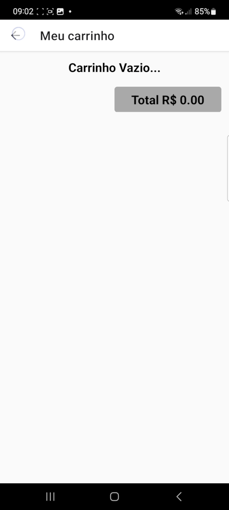

# Shopping Cart

## Resume
Project to practice using hooks to build a shopping cart for e-commerce apps.

For this application, the <u><b>React Native</b></u> Framework was used.

* <u><b>Hooks</b></u>: useState, useContext, useNavigation.

* <u><b>Libraries</b></u>: react-native-vector-icons, react-navigation/drawer.

* <u><b>Styled-components.</b></u>

# Interface

## <u>Products list:</u>

  

## <u>Products add in the cart:</u>

  

## <u>Cart with Products:</u>

  

## <u>Products altered in the cart:</u>

  

## <u>Empty Cart:</u>

  

